# COM3D2.MotionTimelineEditor.Plugin

v4.3.0.1


- [COM3D2.MotionTimelineEditor.Plugin](#com3d2motiontimelineeditorplugin)
  - [概要](#概要)
  - [インストール方法](#インストール方法)
  - [推奨MOD](#推奨mod)
  - [タイムライン制作の流れ](#タイムライン制作の流れ)
  - [キーボード操作](#キーボード操作)
  - [メインウィンドウ](#メインウィンドウ)
    - [メインメニュー](#メインメニュー)
    - [タイムライン操作](#タイムライン操作)
    - [キーフレーム操作](#キーフレーム操作)
    - [範囲操作](#範囲操作)
    - [レイヤー操作](#レイヤー操作)
    - [モード切り替え](#モード切り替え)
  - [タイムライン](#タイムライン)
    - [キーフレームの色](#キーフレームの色)
    - [基本操作](#基本操作)
  - [レイヤー](#レイヤー)
    - [メイドアニメレイヤー](#メイドアニメレイヤー)
      - [ボーン編集](#ボーン編集)
      - [ボーン追加](#ボーン追加)
      - [手指(足指)編集](#手指足指編集)
    - [メイド表情レイヤー](#メイド表情レイヤー)
    - [メイド移動レイヤー](#メイド移動レイヤー)
    - [メイド瞳レイヤー](#メイド瞳レイヤー)
      - [視線変更](#視線変更)
      - [瞳の位置/サイズ変更](#瞳の位置サイズ変更)
    - [メイドシェイプレイヤー](#メイドシェイプレイヤー)
      - [シェイプ追加](#シェイプ追加)
      - [シェイプ操作](#シェイプ操作)
    - [メイドボイスレイヤー](#メイドボイスレイヤー)
      - [ボイス一覧出力](#ボイス一覧出力)
    - [メイド脱衣レイヤー](#メイド脱衣レイヤー)
    - [カメラレイヤー](#カメラレイヤー)
    - [モデルレイヤー](#モデルレイヤー)
      - [モデル操作](#モデル操作)
      - [モデル管理](#モデル管理)
    - [モデルボーンレイヤー](#モデルボーンレイヤー)
    - [モデルシェイプレイヤー](#モデルシェイプレイヤー)
    - [背景レイヤー](#背景レイヤー)
    - [背景色レイヤー](#背景色レイヤー)
    - [背景モデルレイヤー](#背景モデルレイヤー)
      - [管理タブ](#管理タブ)
    - [PNG配置レイヤー](#png配置レイヤー)
    - [ライトレイヤー](#ライトレイヤー)
      - [ライト操作](#ライト操作)
      - [ライト管理](#ライト管理)
    - [ステージライトレイヤー](#ステージライトレイヤー)
      - [ステージライト一括操作](#ステージライト一括操作)
      - [ステージライト個別操作](#ステージライト個別操作)
    - [ステージレーザーレイヤー](#ステージレーザーレイヤー)
      - [ステージレーザー一括操作](#ステージレーザー一括操作)
      - [ステージレーザー個別操作](#ステージレーザー個別操作)
    - [サイリウムレイヤー](#サイリウムレイヤー)
      - [基本タブ](#基本タブ)
      - [バータブ](#バータブ)
      - [持ち手タブ](#持ち手タブ)
      - [アニメタブ](#アニメタブ)
      - [エリアタブ](#エリアタブ)
    - [効果音レイヤー](#効果音レイヤー)
    - [ポストエフェクトレイヤー](#ポストエフェクトレイヤー)
      - [被写界深度](#被写界深度)
      - [パラフィン](#パラフィン)
      - [距離フォグ](#距離フォグ)
      - [リムライト](#リムライト)
    - [テキストレイヤー](#テキストレイヤー)
  - [サブウィンドウ](#サブウィンドウ)
    - [ロードウィンドウ](#ロードウィンドウ)
    - [情報ウィンドウ](#情報ウィンドウ)
    - [キーフレーム詳細ウィンドウ](#キーフレーム詳細ウィンドウ)
    - [IK固定ウィンドウ](#ik固定ウィンドウ)
    - [トラック設定ウィンドウ](#トラック設定ウィンドウ)
    - [操作履歴ウィンドウ](#操作履歴ウィンドウ)
    - [設定ウィンドウ](#設定ウィンドウ)
      - [個別設定](#個別設定)
      - [1フレーム調整](#1フレーム調整)
      - [共通設定](#共通設定)
      - [BGM設定](#bgm設定)
      - [動画設定](#動画設定)
      - [グリッド設定](#グリッド設定)
  - [保存形式](#保存形式)
    - [タイムライン出力](#タイムライン出力)
    - [アニメ出力](#アニメ出力)
    - [DCM出力](#dcm出力)
  - [変更履歴](#変更履歴)
    - [2025/01/11 v4.3.0.1](#20250111-v4301)
    - [2025/01/10 v4.3.0.0](#20250110-v4300)
    - [2024/12/18 v4.2.0.0](#20241218-v4200)
    - [2024/12/17 v4.1.0.0](#20241217-v4100)
    - [2024/12/11 v4.0.0.0](#20241211-v4000)
    - [2024/11/10 v3.0.0.3](#20241110-v3003)
    - [2024/11/09 v3.0.0.2](#20241109-v3002)
    - [2024/11/09 v3.0.0.1](#20241109-v3001)
    - [2024/11/09 v3.0.0.0](#20241109-v3000)
    - [2024/10/22 v2.9.0.1](#20241022-v2901)
    - [2024/10/21 v2.9.0.0](#20241021-v2900)
    - [2024/10/13 v2.8.0.0](#20241013-v2800)
    - [2024/08/14 v2.7.0.1](#20240814-v2701)
    - [2024/08/13 v2.7.0.0](#20240813-v2700)
    - [2024/06/25 v2.6.0.0](#20240625-v2600)
    - [2024/06/18 v2.5.0.0](#20240618-v2500)
    - [2024/06/13 v2.4.0.2](#20240613-v2402)
    - [2024/06/12 v2.4.0.1](#20240612-v2401)
    - [2024/06/11 v2.4.0.0](#20240611-v2400)
    - [2024/06/03 v2.3.0.0](#20240603-v2300)
    - [2024/05/27 v2.2.0.0](#20240527-v2200)
    - [2024/05/19 v2.1.0.0](#20240519-v2100)
    - [2024/05/14 v2.0.0.0](#20240514-v2000)
    - [2024/04/21 v1.3.0.1](#20240421-v1301)
    - [2024/04/21 v1.3.0.0](#20240421-v1300)
    - [2024/04/15 v1.2.0.2](#20240415-v1202)
    - [2024/04/14 v1.2.0.1](#20240414-v1201)
    - [2024/04/14 v1.2.0.0](#20240414-v1200)
    - [2024/04/07 v1.1.0.0](#20240407-v1100)
    - [2024/04/03 v1.0.0.1](#20240403-v1001)
    - [2024/04/02 v1.0.0.0](#20240402-v1000)
  - [規約](#規約)
    - [作成したデータについて](#作成したデータについて)
    - [MOD規約](#mod規約)
    - [プラグイン開発者向け](#プラグイン開発者向け)


## 概要

モーションやカメラをタイムラインで編集するプラグインです。

MMDに近い操作でモーションを作成することを目的にしています。


## インストール方法

[Releases](https://github.com/kidonaru/COM3D2.MotionTimelineEditor.Plugin/releases)
から最新の`COM3D2.MotionTimelineEditor.Plugin-vX.X.X.zip`をダウンロードします。

zip解凍後、`UnityInjector`フォルダの中身を、`Sybaris\UnityInjector`フォルダに配置してください。

各ファイルの説明:
- `COM3D2.MotionTimelineEditor.Plugin.dll`
  - プラグインの本体。必須ファイル
- `COM3D2.MotionTimelineEditor_MeidoPhotoStudio.Plugin.dll`
  - MeidoPhotoStudioで動作するようになります。任意で配置してください
- `COM3D2.MotionTimelineEditor_MultipleMaids.Plugin.dll`
  - 複数メイド撮影プラグインで動作するようになります。任意で配置してください
- `COM3D2.MotionTimelineEditor_DCM.Plugin.dll`
  - DCMプラグインを使用して表情/カメラなどが制御可能になります。任意で配置してください
- `COM3D2.MotionTimelineEditor_SceneCapture.Plugin.dll`
  - SceneCaptureプラグインで動作するようになります。任意で配置してください
- `COM3D2.MotionTimelineEditor_PartsEdit.Plugin.dll`
  - PartsEditプラグインで動作するようになります。任意で配置してください
- `COM3D2.MotionTimelineEditor_PngPlacement.Plugin.dll`
  - PngPlacementプラグインで動作するようになります。任意で配置してください
- `Config/MotionTimelineEditor_ExtraModel.csv`
  - 公式で対応していないモデルを追加するための設定ファイル

COM3D2 Ver.2.33.1で動作確認済みです。


## 推奨MOD

複数メイドプラグインかMeidoPhotoStudioのどちらかが入っていれば、エディット画面で動作するようになります。

- **複数メイド撮影プラグインver23.1**
  - https://ux.getuploader.com/cm3d2_j/download/181

- **MeidoPhotoStudio**
  - https://github.com/habeebweeb/MeidoPhotoStudio/releases


DCMが導入済みの場合、表情/カメラなどの制御が可能になります。

- **COM3D2.DanceCameraMotion.Plugin7.5.1**
  - https://ux.getuploader.com/com3d2_mod_kyouyu_g/download/98
  - https://ux.getuploader.com/com3d2_mod_kyouyu_g/download/79


SceneCaptureプラグインで配置したモデルの制御も可能です。

- **COM3D2.SceneCapture.Plugin v0.3.1.30**
  - 現在未公開


PartsEditプラグインでモデルのボーンを操作して、タイムラインに保存することができます。

- **PartsEditWithStudio.Plugin_v0.1.7.2**
  - https://ux.getuploader.com/com3d2_mod_kyouyu_g/download/51


PngPlacementプラグインでPNG画像のアニメ制御が可能です。

- **COM3D2用 png配置plugin**
  - https://ux.getuploader.com/com3d2_mod_kyouyu/download/123


## タイムライン制作の流れ


https://github.com/kidonaru/COM3D2.MotionTimelineEditor.Plugin/assets/4057300/80714575-838d-4900-bed9-970310aaf776


1. **GUIの表示**: スタジオモード中か、エディット画面で`Ctrl+M`を押してGUIを表示します。歯車メニューの「MTE」アイコンからも表示できます。

2. **複数メイドの有効化**: エディット画面の場合は`F7`を押して、複数メイド撮影プラグインを有効化します。

3. **タイムラインの作成**: メイドを配置した後、ファイルメニューから新規作成ボタンをクリックして、タイムラインを作成します。0Fには現在のポーズがキーフレームとして自動的に追加されます。

4. **編集モード**: 編集モードのチェックをいれて、編集モードを有効化します。

5. **フレームの選択**: タイムラインの上部に表示されている任意のフレーム数をクリックして、編集したいフレームを選択します。

6. **ポーズの変更**: IKをドラッグしてポーズを変更します。
スタジオモード中は、タイムライン左側のボーン名をクリックすると、そのボーンの角度調整UIが表示されます。

7. **キーフレームの登録**: `Enter`キーを押して、変更したボーンのキーフレームを登録します。

8. **確認**: 再生ボタン(`Space`キー)を押して、モーションを確認します。その後は4-8を繰り返して、モーションを調整します。

9. **レイヤー変更**: レイヤーを切り替えて、表情やカメラの設定を行います。

10. **タイムラインの保存**: セーブボタンを押してタイムラインを保存します。保存したタイムラインは、ロードウィンドウからいつでもロード可能です。


## キーボード操作

| キー            | 機能                     |
|-----------------|--------------------------|
| **Ctrl+M**      | プラグイン表示切り替え   |
| **Tab**         | UI表示切り替え          |
| **Enter**       | キーフレームの登録 (編集モード中のみ) |
| **Shift+Enter** | キーフレームの全登録 (編集モード中のみ) |
| **Backspace**   | キーフレーム削除         |
| **Space**       | 再生/停止                |
| **F1**          | 編集モードの切り替え |
| **Ctrl+C**      | 選択したキーフレームのコピー |
| **Ctrl+V**      | コピーしたキーフレームのペースト |
| **Ctrl+Shift+V**| 反転ペースト             |
| **Ctrl+Alt+C**  | ポーズコピー             |
| **Ctrl+Alt+V**  | ポーズペースト (編集モード中のみ) |
| **A**           | 前のフレームへ           |
| **D**           | 次のフレームへ           |
| **Ctrl+A**      | 前のポイントへ           |
| **Ctrl+D**      | 次のポイントへ           |
| **Shift**       | 複数選択                 |
| **Ctrl+Z**      | 操作履歴を一つ戻す       |
| **Ctrl+X**      | 操作履歴を一つ進める     |

一度起動すると下記パスに設定ファイルが作成されるので、
キーを変更したい場合はこちらを編集してください。
`Sybaris\UnityInjector\Config\MotionTimelineEditor.xml`

UnityのKeyCodeを使用できます。
https://docs.unity3d.com/ja/560/ScriptReference/KeyCode.html


## メインウィンドウ

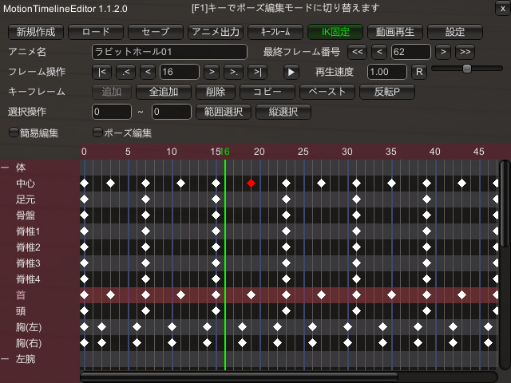

### メインメニュー
- **ファイル**: ファイル出力まわりの操作
  - **新規作成**: タイムラインを新規に作成
  - **アニメ出力**: モーションをマイポーズに出力
  - **DCM出力**: DCM形式で出力
- **セーブ**: 現在のタイムラインを保存
- **ロード**: タイムラインのロードウィンドウを表示
- **情報**: 情報ウィンドウを表示
- **キーフレーム**: キーフレーム詳細ウィンドウを表示
- **IK固定**: IK固定の設定ウィンドウを表示
- **トラック**: トラック設定ウィンドウを表示
- **履歴**: 操作履歴ウィンドウを表示
- **設定**: タイムラインの設定ウィンドウを表示

### タイムライン操作
- **アニメ名**: モーションの名前を設定
- **最終フレーム番号**: 最終フレーム番号を設定
- **フレーム操作**: 現在のフレーム位置を操作
- **再生/停止**: モーションの再生と停止を切り替え
- **再生速度**: モーションの再生速度を調整

### キーフレーム操作
- **登録**: 変更されたボーンをキーフレームに登録 (編集モード中のみ)
- **全登録**: 全ボーンをキーフレームに登録
- **削除**: 選択中のキーフレームを削除
- **コピー**: 選択中のキーフレームをコピー
- **ペースト**: コピーしたキーフレームを現在のフレームに貼り付け
- **反転P**: 左右反転させて貼り付け
- **ポーズC**: 現在のポーズをキーフレームとしてコピー (編集モード中のみ)
- **ポーズP**: コピーしたキーフレームを現在のポーズに反映 (編集モード中のみ)

### 範囲操作
- **範囲選択**: 指定範囲内の全キーフレームを選択
- **フレーム挿入**: 指定範囲に新しいフレームを挿入 (0Fは挿入不可)
- **フレーム削除**: 指定範囲のフレームを削除 (0Fは削除不可)
- **フレーム複製**: 指定範囲のフレームを複製
- **縦選択**: 選択しているキーフレームと、同一フレームのキーフレームを選択

### レイヤー操作
- **レイヤー**: 操作対象のレイヤー種類を選択
- **「-」**: 選択中のレイヤーを削除
- **「+」**: 新しいレイヤーを追加
- **操作対象**: 操作対象のメイドを選択

### モード切り替え
- **簡易表示**: フレーム内のキーフレームを一括で編集できるモードに切り替え
- **編集モード**: 編集モードに切り替え
- **メイド表示**: メイドの表示/非表示を切り替え
- **背景表示**: 背景の表示/非表示を切り替え
- **カメラ同期**: カメラモーションの同期/解除を切り替え
- **視野角固定**: 編集中のカメラの視野角の固定/解除を切り替え
  - オダメのバグで視野角いじるとギズモが触れなくなるので、そのときに固定化すると便利
- **ポスプロ同期**: ポストエフェクトの同期/解除を切り替え
- **中心点IK表示**: 中心点IKの表示/非表示を切り替え (スタジオモード中のみ)
- **関節IK表示**: 各関節IKの表示/非表示を切り替え (スタジオモード中のみ)


## タイムライン

### キーフレームの色
- **白**: 登録されているキーフレーム
- **赤**: 選択中のキーフレーム
- **グレー**: 一部のボーンが登録されているキーフレーム

### 基本操作
- **フレーム番号**: クリックでそのフレームに移動
- **ボーンリスト**: 左のボーン名を選択して、ボーンの角度調整UI表示 (スタジオモード中の編集モードのみ)
  - ボーンカテゴリのー＋をクリックで、カテゴリ内のボーンリストの表示/非表示を切り替え
  - 編集中にマウスオーバーで、キーフレームの追加/削除ボタンの表示
- **ドラッグ**: キーフレームをドラッグして移動
- **エリア選択**: キーフレーム以外の場所をドラッグで、短形内のキーフレームを選択
- **複数選択**: `Shift`キーを押しながらキーフレームをクリックで複数選択


## レイヤー

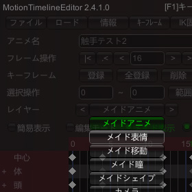

操作対象の種類のことをレイヤーと呼びます。

DCMを導入している場合、レイヤーを切り替えることで、
表情/カメラ/モデル/背景などの操作が可能になります。

編集モードにして情報ウィンドウから各パラメータを変更した後、
`Enter`キーでキーフレームを登録するとタイムラインに反映されます。

- [メイドアニメレイヤー](#メイドアニメレイヤー): メイドのモーション制御
- [メイド表情レイヤー](#メイド表情レイヤー): メイドの表情制御
- [メイド移動レイヤー](#メイド移動レイヤー): メイドの移動/回転制御
- [メイド瞳レイヤー](#メイド瞳レイヤー): メイドの瞳位置/サイズ制御
- [メイドボイスレイヤー](#メイドボイスレイヤー): メイドのボイス制御
- [メイドシェイプレイヤー](#メイドシェイプレイヤー): メイドのシェイプキー制御
- [メイド脱衣レイヤー](#メイド脱衣レイヤー): メイドの脱衣制御
- [カメラレイヤー](#カメラレイヤー): カメラの制御
- [モデルレイヤー](#モデルレイヤー): モデルの移動/回転/拡縮の制御
- [モデルボーンレイヤー](#モデルボーンレイヤー): モデルのボーン制御
- [モデルシェイプレイヤー](#モデルシェイプレイヤー): モデルのシェイプキー制御
- [背景レイヤー](#背景レイヤー): 背景の制御
- [背景色レイヤー](#背景色レイヤー): 背景色の制御
- [背景モデルレイヤー](#背景モデルレイヤー): 背景モデルの制御
- [PNG配置レイヤー](#png配置レイヤー): PNG画像の配置制御
- [ライトレイヤー](#ライトレイヤー): ライトの制御
- [ステージライトレイヤー](#ステージライトレイヤー): ステージライトの制御
- [ステージレーザーレイヤー](#ステージレーザーレイヤー): ステージレーザーの制御
- [サイリウムレイヤー](#サイリウムレイヤー): サイリウムの制御
- [効果音レイヤー](#効果音レイヤー): 効果音の制御
- [ポストエフェクトレイヤー](#ポストエフェクトレイヤー): ポストエフェクトの制御
- [テキストレイヤー](#テキストレイヤー): テキストの制御


### メイドアニメレイヤー

#### ボーン編集

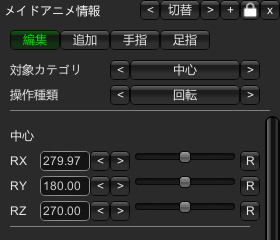

各ボーンの値を調整することができます。

- **対象カテゴリ**: 表示対象のメニューカテゴリを選択
- **操作種類**: 操作対象のパラメータを選択

#### ボーン追加

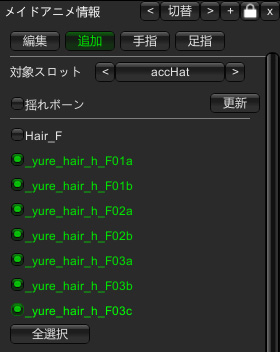

標準ボーン以外のボーンを操作対象に追加することができます。
チェックを入れたボーンが追加されます。

- **対象スロット**: 対象のスロットを選択
- **揺れボーン**: 揺れボーンの有効/無効を切り替え
- **更新**: ボーン一覧を更新
- **全選択/全解除**: 全てのボーンを選択/解除

#### 手指(足指)編集

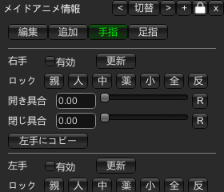

指のブレンドを変更することができます。
(スタジオモードと同等機能)


### メイド表情レイヤー

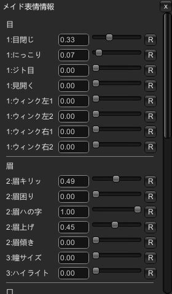

表情を調整することができます。

- **強制上書き**: 他プラグインでの表情変更を無視して設定します。


### メイド移動レイヤー

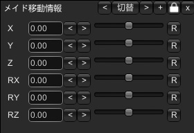

メイドの移動/回転/拡縮を調整することができます。


### メイド瞳レイヤー

#### 視線変更

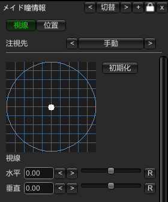

メイドの視線を変更することができます。

共通設定で顔/瞳の固定化を有効にしている場合にのみ制御できます。

- **注視先**: 注視先を設定
- **メイド**: 注視先のメイドを選択
- **ポイント**: 注視先のポイントを選択
- **モデル**: 注視先のモデルを選択


#### 瞳の位置/サイズ変更

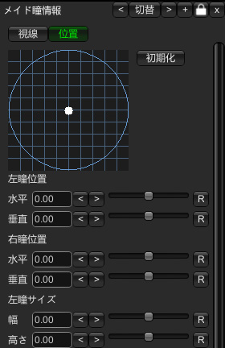

画像上をドラッグすることで、瞳の位置を変更することができます。
数値入力で各位置とサイズを変更することも可能です。


### メイドシェイプレイヤー

#### シェイプ追加


操作対象のシェイプキーを追加することができます。

#### シェイプ操作

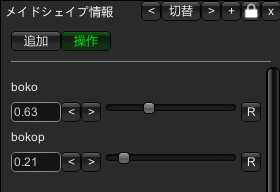

追加したシェイプキーを操作することができます。


### メイドボイスレイヤー

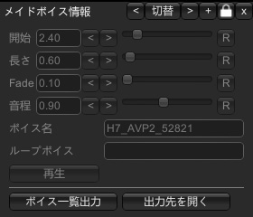

メイドのボイスを制御することができます。

- **開始**: ボイスの再生開始位置を設定
- **長さ**: ボイスの再生時間を設定
- **Fade**: ボイスのフェードイン/アウト時間を設定
- **音程**: ボイスのピッチを設定
- **ボイス名**: 再生するボイスを指定
  - C: コピー P: ペースト
- **ループボイス**: ループ再生するボイスを指定
- **再生**: 設定したボイスの再生確認

#### ボイス一覧出力

https://github.com/kidonaru/COM3D2.MotionTimelineEditor.Plugin/assets/4057300/bd5078e1-57a4-414c-8129-49bb2eba1a19

ボイス一覧出力ボタンを押すと、`Sybaris\UnityInjector\Config\MotionTimelineEditor`内に性格毎のボイス一覧がcsvで出力されます。

全スクリプトをパースしているため、出力に数時間かかる場合があります。

出力したcsvはスプレッドシートなどで管理すると便利です。


### メイド脱衣レイヤー

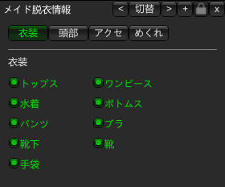

衣装の脱衣、めくれ状態を操作することができます。


### カメラレイヤー


カメラの位置/角度/視野角などを操作することができます。

- **距離**: カメラの距離を変更
- **FoV**: カメラの視野角を変更
- **対象設定**: カメラを対象の位置まで移動させます
  - **対象メイド**: 対象のメイドを選択
  - **対象ポイント**: 移動先の部位を選択
  - **対象モデル**: 対象のモデルを選択


### モデルレイヤー

#### モデル操作

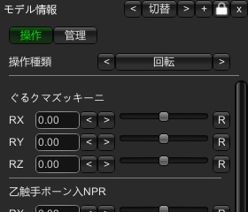

モデルの移動/回転/拡縮を調整することができます。


#### モデル管理

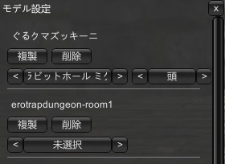

モデルの制御プラグインの変更や、アタッチポイントの設定などができます。

- **チェックボックス**: 表示の有効/無効を切り替え
- **プラグイン名**: モデル操作するプラグインを選択します
- **複製**: タイムライン含めてモデルの複製を作成
- **削除**: モデルを削除
- **メイド選択**: アタッチするメイドを選択
- **アタッチポイント**: アタッチする場所を選択


### モデルボーンレイヤー

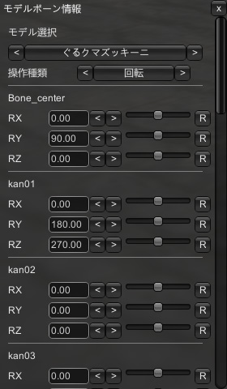

モデルボーンの移動/回転/拡縮を調整することができます。

- **モデル選択**: 操作対象のモデルを選択
- **操作種類**: 操作するパラメータを選択


### モデルシェイプレイヤー


モデルのシェイプキーの値を変更することができます。
値の範囲は-1 ~ 2まで設定可能です。

- **モデル選択**: 操作対象のモデルを選択


### 背景レイヤー

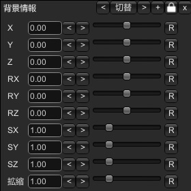

背景の位置/角度/スケールを変更することができます。

- **背景**: 背景を選択


### 背景色レイヤー

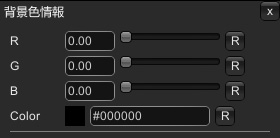

背景色を変更することができます。


### 背景モデルレイヤー

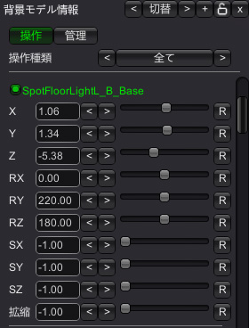

背景内の各オブジェクトを操作することができます。


#### 管理タブ

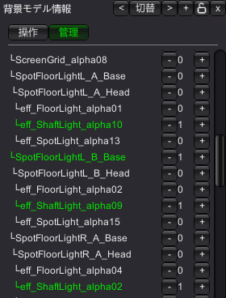

操作するオブジェクトを選択します。


### PNG配置レイヤー

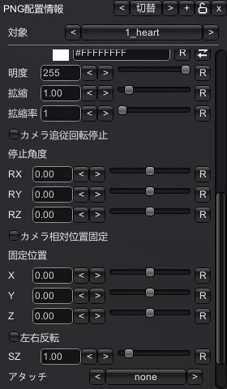

PngPlacement.Pluginを導入している場合、PNGオブジェクトのアニメ制御ができます。
現状PNGオブジェクトのみ対応、エフェクトは非対応です。


### ライトレイヤー

#### ライト操作

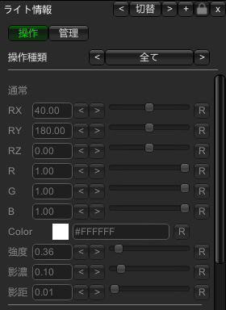

ライトの各パラメータを調整することができます。


#### ライト管理

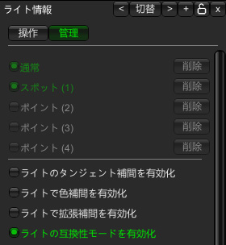

ライトの削除、有効/無効の切り替え、設定変更ができます。
(削除はスタジオモード非対応)

- **ライトのタンジェント補間を有効化**: ライトの補間にタンジェント補間を使用します
  - タンジェント補間では自動補間が使えるなどのメリットがありますが、DCM互換性がなくなります
- **ライトで色補間を有効化**: 有効にすると、ライトの補間で色のパラメータも補間が有効になります
- **ライトで拡張補間を有効化**: 有効にすると、ライトの補間で範囲/強度などのパラメータも補間が有効になります
- **ライトの互換性モードを有効化**: 有効にすると、スタジオモードのスポットライトの見た目をMultipleMaids/MPSと合わせることができます
  - v4.3.0.0以前のタイムラインはデフォルト無効、v4.3.0.1以降に作成したタイムラインはデフォルトで有効になっています


### ステージライトレイヤー

疑似ボリュームライトを表示することができます。


#### ステージライト一括操作

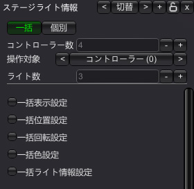

ステージライトを一括で操作することができます。

- **コントローラー数**: グループの数を設定
- **ライト数**: グループ内のライト数を設定
- **一括表示設定**: 一括で表示/非表示を切り替え
- **一括位置設定**: 一括で位置を設定
- **一括角度設定**: 一括で角度を設定
- **一括色設定**: 一括で色を設定
- **一括ライト情報設定**: 一括でライト情報を設定


#### ステージライト個別操作

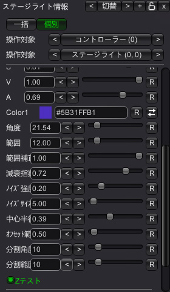

ステージライトの個別パラメータを調整することができます。
一括操作が有効になっている場合は個別操作はできません。

- **角度**: スポットライトの開く角度を設定
- **範囲**: 照らす距離を設定
- **範囲補正**: 照らす距離補正を設定
- **減衰指数**: 距離に応じた減衰指数を設定
- **ノイズ強度**: ノイズ強度を設定
- **ノイズサイズ**: ノイズサイズを設定
- **中心半径**: 中心の半径を設定
- **オフセット範囲**: ライトの開始距離を設定
- **分割角度**: メッシュの分割角度を設定
- **分割範囲**: メッシュの分割範囲を設定
- **Zテスト**: Zテストの有効/無効を切り替え


### ステージレーザーレイヤー

ライブのレーザーを表示することができます。


#### ステージレーザー一括操作

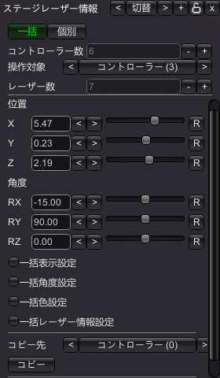

レーザーを一括で操作することができます。

- **コントローラー数**: グループの数を設定
- **レーザー数**: グループ内のレーザー数を設定
- **位置**: レーザーの開始位置を設定
- **角度**: レーザーの開始角度を設定
- **一括表示設定**: 一括で表示/非表示を切り替え
- **一括角度設定**: 一括で角度を設定
- **一括色設定**: 一括で色を設定
- **一括レーザー情報設定**: 一括でレーザー報を設定


#### ステージレーザー個別操作

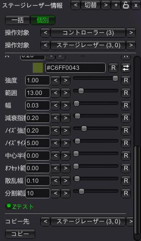

ステージレーザーの個別パラメータを調整することができます。
一括操作が有効になっている場合は個別操作はできません。

- **強度**: レーザーの強さを設定
- **範囲**: 照らす距離を設定
- **幅**: レーザーの幅を設定
- **減衰指数**: 距離に応じた減衰指数を設定
- **ノイズ強度**: ノイズ強度を設定
- **ノイズサイズ**: ノイズサイズを設定
- **中心半径**: 中心の半径を設定
- **オフセット範囲**: レーザーの開始距離を設定
- **錯乱幅**: 散乱光の幅を設定
- **分割範囲**: メッシュの分割範囲を設定
- **Zテスト**: Zテストの有効/無効を切り替え


### サイリウムレイヤー

サイリウムの制御ができます。


#### 基本タブ

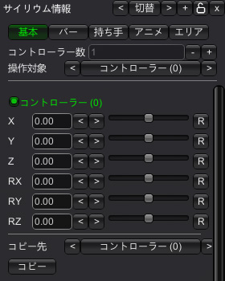

ルート位置を指定します。


#### バータブ

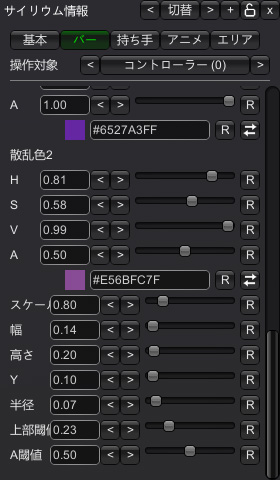

バーの設定を行います。

- **中心色**: バーの中心色を設定
- **縁色**: バーの縁色を設定
- **散乱色**: バーの散乱色を設定
- **スケール**: バーのスケールを設定、バーのスケールを変更すると、様々なパラメータに補正がかかります
- **幅**: バーの幅を設定
- **高さ**: バーの高さを設定
- **Y**: バーのY座標を設定
- **半径**: バーの半径(厚み)を設定
- **上部閾値**: 上部閾値を設定、この閾値部分をビルボードにして厚みを表現します
- **A閾値**: アルファカットオフの指定


#### 持ち手タブ

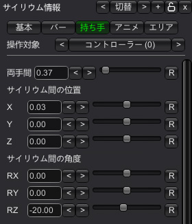

持ち手の設定を行います。

- **両手間**: 両手間の距離を設定
- **サイリウム間の位置**: サイリウムを複数持ったときの間隔を設定
- **サイリウム間の角度**: サイリウムを複数持ったときの角度を設定


#### アニメタブ

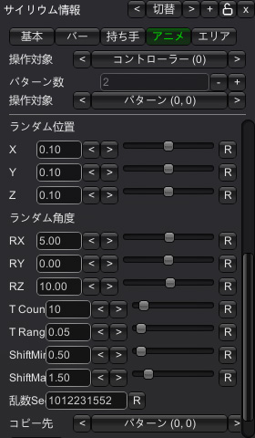

アニメーションの設定を行います。
10パターンまで登録可能で、ランダムなサイリウムで再生されます。

- **両手/左手/右手**: どの手のアニメを設定するか選択
- **移動/回転**: 移動/回転のアニメーションを設定
- **ランダム位置/角度**: ランダムな位置/角度を設定
- **T Count**: ランダムな時間のパターン数を設定
- **T Range**: ランダムな時間の範囲を設定
- **ShiftMin/Max**: この時間の範囲で各サイリウムのランダムな時間をずらします
- **乱数Seed**: 乱数のシードを設定


#### エリアタブ

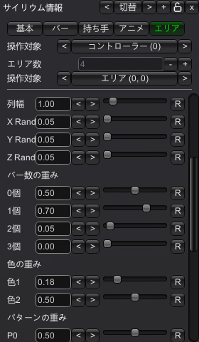

サイリウムの表示範囲を設定します。

- **X/Y/Z**: エリアの表示位置を設定
- **RX/RY/RZ**: エリアの表示角度を設定
- **SX/SY**: エリアの表示サイズを設定
- **席幅**: 各席間の幅を設定
- **列幅**: 各列間の幅を設定
- **X/Y/Z Random**: 席のランダムな位置を設定
- **バー数の重み**: 片手毎に何本のバーを持つかの重みを設定
- **色の重み**: サイリウムの色の重みを設定
- **パターンの重み**: 再生するアニメーションパターンの重みを設定
- **乱数Seed**: 乱数のシードを設定


### 効果音レイヤー

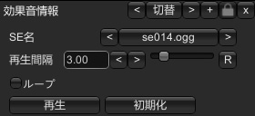

効果音を再生することができます。

- **SE名**: 再生するSEを選択
- **再生間隔**: SEの再生間隔を設定
- **ループ**: SEをループ再生するか設定


### ポストエフェクトレイヤー

ポストエフェクトの調整ができます。

#### 被写界深度

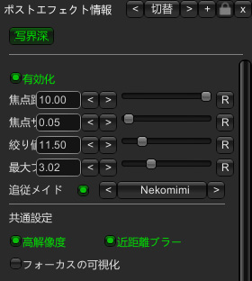

被写界深度を調整することができます。

- **ピント距離**: カメラから焦点への距離を設定
- **焦点距離**: カメラセンサーとカメラレンズの間の距離
- **絞り値**: 開口率を設定
- **ブラーサイズ**: 最大ブラーの値を設定
- **追従メイド**: 指定したメイドの位置にピントを合わせる


#### パラフィン

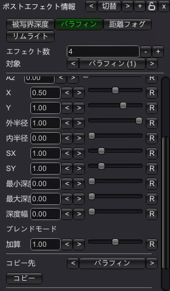

画面に円状のパラフィンをかけることができます。

- **エフェクト数**: パラフィンの数を設定 (最大4つまで有効化可能)
- **X/Y**: 画面上の円の位置を設定
- **内/外半径**: フェード開始する内/外半径を設定
- **SX/SY**: 円のスケールを設定
- **最小深度/最大深度/深度幅**: エフェクトをかける深度を設定
- **ブレンド**: ブレンドモードを設定、基本は加算のみで設定のブレンド拡張を有効にすると、他のブレンドモードも使用可能


#### 距離フォグ

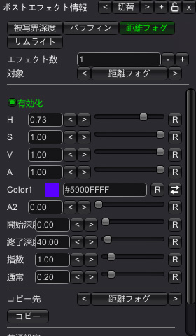

カメラからの距離に応じたフォグをかけることができます。

- **エフェクト数**: フォグの数を設定 (最大1つまで有効化可能)
- **開始/終了深度**: フォグの開始/終了深度を設定
- **指数**: フォグの指数を設定
- **ブレンド**: ブレンドモードを設定、基本は通常のみで設定のブレンド拡張を有効にすると、他のブレンドモードも使用可能


#### リムライト

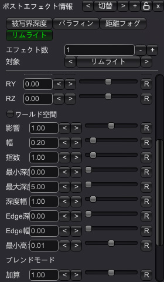

キャラの輪郭にライトを当てることができます。

- **エフェクト数**: リムライトの数を設定 (最大4つまで有効化可能)
- **RX/RY/RZ**: ライトの角度を設定
- **ワールド空間**: ライトの角度をワールド空間で設定
- **影響**: ライトの影響範囲を設定
- **幅**: フェードの幅を設定
- **指数**: フェードの指数を設定
- **最小深度/最大深度/深度幅**: エフェクトをかける深度を設定
- **Edge深度/幅**: エッジの深度と幅を設定、設定するとエッジの範囲のみにリムライトを適用します
- **最小高さ**: エフェクトをかける高さの最小値を設定 (0で無効化)
- **ブレンド**: ブレンドモードを設定、基本は加算のみで設定のブレンド拡張を有効にすると、他のブレンドモードも使用可能


### テキストレイヤー

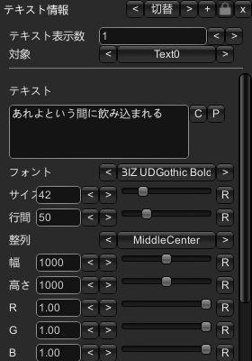

字幕の表示制御ができます。


## サブウィンドウ

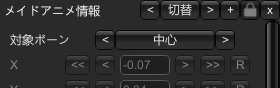

メインメニューで項目を選択すると、項目に応じたサブウィンドウが表示されます。

ヘッダーの操作:
- **切替**: サブウィンドウの種類の切り替え
- **+**: サブウィンドウの追加
- **ロック**: 有効にすると、他のウィンドウと位置を同期します
- **閉じる**: ウィンドウを閉じる


### ロードウィンドウ

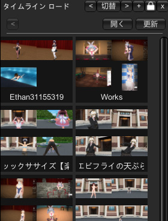

保存したタイムラインをロードすることができます。

サブディレクトリにも対応しているため、エクスプローラで開いてフォルダを作成し、タイムラインを移動することで階層的に管理できます。

- **開く**: 保存先のフォルダを開く
- **更新**: ファイル一覧を更新


### 情報ウィンドウ


選択中のレイヤーに応じて各パラメータの現在値を表示します。

編集モード中では、各パラメータ値の編集も可能です。

汎用的な操作:
- **X, Y, Z**: 対象の位置を変更
- **RX, RY, RZ**: 対象の角度を変更
- **SX, SY, SZ**: 対象のスケールを変更


### キーフレーム詳細ウィンドウ

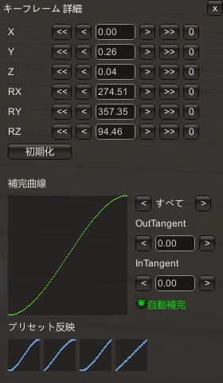

- **X, Y, Z**: 選択したキーフレームの位置を調整
  - テキストボックスに数値を入力すると、選択したキーフレームの位置がその値になります
  - 複数の値が存在する場合は、空欄になります
  - `<<` `<` `>` `>>`ボタンで、0.01、0.1ずつ相対的に移動します
  - 移動は中心ボーンのみ変更できます
- **RX, RY, RZ**: 選択したキーフレームの角度を調整
  - `<<` `<` `>` `>>`ボタンで、1、10ずつ相対的に変更します
- **初期化**: 選択したキーフレームの位置と角度を初期化
- **補間曲線**: 選択したキーフレームの補間曲線を表示します
- **Tangent設定**: Tangentに対応したキーフレームの場合、Tangentの設定が可能です
  - **表示種類**: 右の選択ボタンで、表示する補間曲線の種類を切り替えます
  - **OutTangent**: 前のフレームのOutTangentを調整
  - **InTangent**: 選択中のフレームのInTangentを調整
  - **自動補間**: 自動補間を有効にする
  - **プリセット反映**: プリセットを反映します
    - EaseInOut、EaseIn、EaseOut、Linearが選択可能
- **Easing設定**: Easingに対応したキーフレームの場合、Easingの設定が可能です
  - **Easing**: Easingの種類を選択


### IK固定ウィンドウ

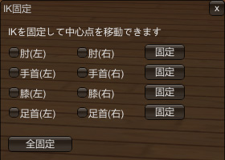

各IKをワールド座標に固定化することができます。
基本的に手首/足首のIKを固定化しておくとアニメーションが付けやすい。

- **IKアニメーション**: タイムライン再生中もIKが有効になります
  - ブレやすいので、最小限の使用をおすすめします
- **左/右足の接地**: 足首の位置を地面に固定します (足首IKを固定する必要があります)
- **床の高さ**: 地面の高さを設定
- **メイドの位置から推定**: 現在のメイドの位置から床の高さを自動設定します
- **足首の高さ**: 足首の高さを設定
- **伸ばす高さ**: この高さ以上になると足首を伸ばします
- **伸ばす角度**: 伸ばしたときの足首の角度を設定
- **設置時角度**: 地面に設置したときの足首の角度を設定


### トラック設定ウィンドウ

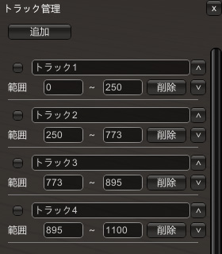

特定の範囲内に限定して編集、再生することができます。

長いタイムラインでは動作が重くなるので、トラックを使って編集することをおすすめします。

範囲の開始、終了位置にキーフレームを全登録することで、より動作の軽量化ができます。

- **追加**: 新しいトラックを追加
- **チェックボックス**: トラックの有効/無効を切り替え
  - トラックが有効の場合、その範囲内のみ編集、再生が可能になります
- **トラック名**: トラックの名前を設定
- **範囲**: トラックの範囲を設定
- **削除**: トラックを削除
- **∧/∨**: トラックを上下に移動


### 操作履歴ウィンドウ

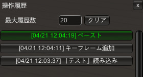

タイムラインの操作履歴が表示されます。

履歴を選択すると、その状態に戻ることができます。

- **最大履歴数**: 保持する最大の履歴数を設定
  - 履歴数分メモリを消費するので、必要な数だけに設定してください
- **クリア**: 履歴をクリア

`Ctrl+Z`で一つ前の履歴に、`Ctrl+X`で一つ後の履歴に戻すことができます。


### 設定ウィンドウ

#### 個別設定


各タイムライン個別の設定を行います

- **格納ディレクトリ名**: タイムラインの保存先のサブディレクトリ名を設定
- **フレームレート**: タイムラインのフレームレートを設定
- **メイド目線**: メイドの目線を設定します
- **1フレーム調整**: 1フレームのキーフレームの挙動を調整します (詳細は後述)
- **顔/瞳の固定化**: カメラ追従を無効にして、タイムラインで制御可能な状態にします
- **胸の物理無効**: 胸の物理演算を無効にする
- **ループアニメーション**: ループ再生用のアニメーションにします
  - 出力時、0Fのキーフレームをコピーして、最終フレームに貼り付けます
- **カメラのタンジェント補間を有効化**: カメラの補間にタンジェント補間を使用します
- **メイド移動のタンジェント補間を有効化**: メイド移動の補間にタンジェント補間を使用します
- **ポストエフェクトの色拡張**: ポストエフェクトの色拡張を有効化します
- **ポストエフェクトのブレンド拡張**: ポストエフェクトのブレンド拡張を有効化します
- **オフセット時間**: DCM出力時の開始/終了時間のオフセットを設定
- **フェード時間**: DCM出力時のフェードイン/アウト時間を設定
- **アスペクト比**: アスペクト比を設定
  - 設定するとレターボックスが表示されます
- **レターボックス透過度**: レターボックスの透過度を設定
- **DCM出力先を開く**: DCM出力先のフォルダを開きます
- **初期化**: タイムライン個別設定を初期化
- **サムネ更新**: サムネイルを再生成します


#### 1フレーム調整

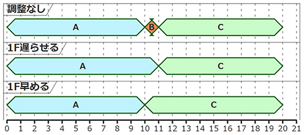

1フレームの長さのキーフレームを配置した場合、通常は1フレーム間で補間が走りますが、0フレームの長さとして扱うことで即時に切り替えることができます。

調整方法として1F遅らせるのと、1F早める方法の2種類があります。

- 調整なし
- 1F遅らせる (デフォルト)
- 1F早める

v2.8.0.0以前に作成されたタイムラインは`1F早める`、v2.9.0.0以降に作成されたタイムラインは`1F遅らせる`がデフォルト挙動です。

機能有効中も、編集モード中は調整していない状態になります。

メイドアニメレイヤーなど反映されないレイヤーもあります。

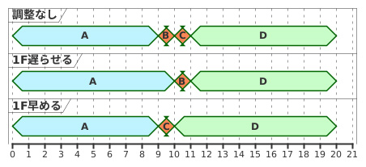

また、1フレームで連続配置した場合は、間のキーフレームは調整後のフレームで補間されます。


#### 共通設定


全タイムライン共通の設定を行います

- **初期補間曲線**: 新規で追加するキーフレームの補間曲線を設定
- **初期イージング**: 新規で追加するキーフレームのイージングを設定
- **Trans詳細表示数**: キーフレーム詳細ウィンドウで表示するTransformの最大数
  - キーフレーム詳細が重い場合は下げると改善することがあります
- **Tangent表示数**: キーフレーム詳細ウィンドウで表示する補間曲線の最大数
- **移動範囲**: 移動スライダーの範囲を設定
- **拡縮範囲**: 拡縮スライダーの範囲を設定
- **自動スクロール**: タイムラインの自動スクロールを有効にする
- **ポーズ履歴無効**: スタジオモードでポーズのUndoを無効化します
- **自動揺れボーン**: メイドの拡張ボーン設定時、揺れボーンを自動で無効化します
- **動画先読み秒数**: ループ再生時に動画を先読みして同期させます
- **ボイス最大秒数**: ボイスの最大再生時間を設定
- **背景透過度**: タイムラインの背景の透過度を設定
- **ボーンリスト幅**: ボーンリストの幅を設定
- **ウィンドウ幅/高さ**: メインウィンドウの幅と高さを設定
- **初期化**: タイムライン共通設定を初期化


#### BGM設定

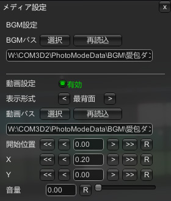

BGMの設定ができます。

DCM出力時に0.5秒の開始遅延があるので、0.5秒後から再生されます。
(開始遅延秒数は個別設定から変更可能)

- **BGMパス**: 再生するBGMファイルのパス
  - 動画のフォーマットはoggかwavを指定できます
- **選択**: BGMを選択
- **再読込**: BGMを再読み込み
- **音量**: BGMの音量を設定
- **BPMライン表示**: 有効にするとタイムライン上にBPMラインが表示されます
- **BPM**: BPMラインのBPMを設定
- **オフセット**: BPMのオフセットフレームを設定


#### 動画設定

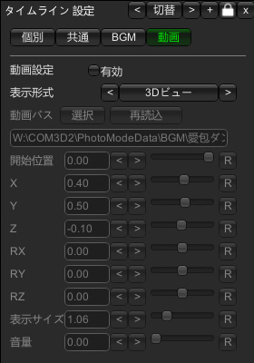

動画の設定ができます。

動画も0.5秒の開始遅延があります。

DCM出力には対応していません。

- **有効**: 動画再生機能を有効にします
- **表示形式**: GUI、3Dビュー、最背面表示を切り替えます
- **動画パス**: 再生する動画ファイルのパス
- **選択**: 動画を選択します
  - 動画のフォーマットは非圧縮aviを推奨します
- **再読込**: 動画を再読み込みします
- **開始位置**: 動画の開始位置を設定
- **X, Y, Z**: 動画の位置を調整
- **RX, RY, RZ**: 動画の角度を調整
- **表示サイズ**: 動画の表示サイズを設定
- **透過度**: 動画の透過度を設定
- **音量**: 動画の音量を設定


#### グリッド設定

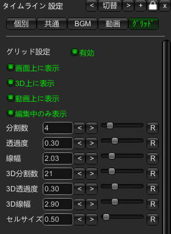

グリッドの表示制御ができます。


## 保存形式

### タイムライン出力

セーブボタンを押すと、`COM3D2\PhotoModeData\_Timeline`ディレクトリに`アニメ名.xml`と、サムネ画像が`アニメ名.png`で保存されます。
タイムラインを共有したい場合は、このファイルを共有してください。

サブディレクトリにも対応しているので、ディレクトリを作成してその中に移動しても読み込めます。

中身のサンプル:

```xml
<TimelineData>
  <Frame>
    <FrameNo>0</FrameNo>
    <Bone>
      <Transform>
        <Name>Bip01</Name>
        <Value>0</Value>
        ...
      </Transform>
    </Bone>
    ...
  </Frame>
  <AnmName>アニメ名</AnmName>
  <IsHold>false</IsHold>
  ...
  <IsLoopAnm>true</IsLoopAnm>
  <MaxFrameNo>30</MaxFrameNo>
  <FrameRate>30</FrameRate>
  <UseMuneKeyL>false</UseMuneKeyL>
  <UseMuneKeyR>false</UseMuneKeyR>
```


### アニメ出力

アニメ出力ボタンから出力されるanmファイルの出力先は、使用しているプラグインによって変わります。

- **複数メイド**: Mod\MultipleMaidsPose
- **MPS**: BepInEx\config\MeidoPhotoStudio\Presets\Custom Poses
- **スタジオモード**: PhotoModeData\MyPose


### DCM出力

DCM出力ボタンを押すと、`UnityInjector\Config\DanceCameraMotion`にDCMで再生可能な形式で出力されます。

DCMで再生するときは処理が干渉することがあるので、MTEを閉じてから再生してください。

出力のサンプル:

```xml
<SongList>
  <song label="【MTE】アニメ名" type="song">
    <folder>【MTE】アニメ名</folder>
    <endTime>15.2666674</endTime>
    <bgm>bgm.ogg</bgm>
    <changeFade>fade.csv</changeFade>
    <maid slotNo="0">
      <pose>pose_0.csv</pose>
      <morph>morph_0.csv</morph>
      <move>move_0.csv</move>
    </maid>
    <maid slotNo="1">
      <move>move_1.csv</move>
      <morph>morph_1.csv</morph>
      <pose>pose_1.csv</pose>
    </maid>
    <changeModel>model.csv</changeModel>
    <changeBg>bg.csv</changeBg>
    <!--<customMotion>camera_timeline.csv</customMotion>-->
    <motion>camera_motion.csv</motion>
  </song>
</SongList>
```

カメラは`customMotion`と`motion`の2つの形式で出力されます。
基本的にどちらも同じ挙動になりますが、`customMotion`ではフレームレート30固定になるのでフレームレートによっては挙動が変わることがあります。


## 変更履歴

### 2025/01/11 v4.3.0.1

挙動修正

- プラグイン起動時にウィンドウが非表示状態になる不具合を修正
- タイムライン新規作成時にレイヤー選択が空欄になる不具合を修正
- ライトの下記設定項目を、個別設定からライト情報の管理タブに移動
  - ライトのタンジェント補間を有効化/ライトで色補間を有効化/ライトで拡張補間を有効化
- ライトの種類/表示非表示がうまく反映されない不具合を修正
  - 既存のタイムラインは見た目が変わる可能性があります 
- ライトの互換性モード設定を追加
  - 有効にすると、スタジオモードのスポットライトの見た目をMultipleMaids/MPSと合わせることができます
  - 基本的に有効にしたほうが良いですが、既存のスタジオモードで作成したタイムラインは見た目が変わる可能性があります(X軸回転90度で同じ見た目になります)
  - v4.3.0.0以前のタイムラインはデフォルト無効、v4.3.0.1以降に作成したタイムラインはデフォルトで有効になっています


### 2025/01/10 v4.3.0.0

機能追加

- PngPlacement.Plugin対応
  - PngPlacement.Pluginがインストール済みの場合、PNGオブジェクトを配置してアニメーションさせることができます
- サイリウムレイヤーの追加
  - サイリウムのアニメーションを再生することができます
- BPMラインの表示
  - BGM設定から有効にすると、タイムライン上にBPMに合わせたラインが表示されます
- レイヤーの追加/削除機能
  - 今までレイヤー選択時に、レイヤーが存在しない場合は自動でレイヤーを作成していたのを、+/-ボタンを追加して手動で追加/削除するように変更しました
  - 初期状態ではメイドアニメレイヤーのみが有効になっているので、+ボタンで制御したいレイヤーを追加してください
  - 不要なレイヤーを削除することで、タイムラインの軽量化が可能です


挙動修正

- ライトのDCM出力時に色が反映されないバグの修正
- メイド移動/ライトのタンジェント補間で同じ値のときに正しく補間されないバグの修正
- タイムライン更新処理の最適化


### 2024/12/18 v4.2.0.0

機能追加

- メイド移動レイヤーの拡縮対応
- 個別設定に「メイド移動のタンジェント補間を有効化」「ライトのタンジェント補間を有効化」を追加
  - 有効にすると自動補間が使えるなどのメリットがありますが、DCM互換性がなくなります
- 個別設定に「ライトで拡張補間を有効化」を追加
  - 有効にすると、ライトの補間で範囲/強度などのパラメータも補間が有効になります

挙動修正

- メイド移動レイヤーで共通設定の初期イージング設定が有効になっていない不具合を修正


### 2024/12/17 v4.1.0.0

機能追加

- ステージレーザーレイヤーの追加

挙動修正

- 複製した背景モデルも管理タブに表示されるように修正
  - 複製した背景モデルの子オブジェクトの複製や操作が可能になります
- 編集モードで1フレーム調整が完全に無効になっていない不具合を修正
- 1フレーム調整で連続キーフレーム配置時に正しく補間されるように修正
- ステージライトで位置の一括操作が反映されない不具合を修正


### 2024/12/11 v4.0.0.0

機能追加

- ポストエフェクトレイヤーにパラフィン/距離フォグ/リムライトを追加
- 背景モデルレイヤーの追加
  - 背景内の各オブジェクトの複製/非表示/移動/回転/拡縮が可能
- ステージライトレイヤーの追加
  - 疑似ボリュームライトの表現が可能
- カラーのHSV編集追加
  - カラー入力テキストエリア横の切り替えボタンでRGB/HSVを切り替え
- キーフレームの全登録のキーバインド追加 (Shift+Enter)
- モデルレイヤーに表示/非表示制御追加

挙動修正

- 動画の同期ズレを修正
  - 共通オプションの動画先読み秒数で調整可能
- 編集モード中のレイヤー変更で編集モードを保持するように
- 各レイヤーの軽量化
- VS2022でビルドするように変更


### 2024/11/10 v3.0.0.3

挙動修正

- スタジオモードでメイド追従ライトが動作しない不具合を修正
- 特定条件でライトが反映されない不具合を修正
- ライト情報をライト別に表示するように修正


### 2024/11/09 v3.0.0.2

挙動修正

- 編集中IKアニメーションが反映されない不具合を修正


### 2024/11/09 v3.0.0.1

挙動修正

- 特定のファイル名でロード失敗する不具合を修正


### 2024/11/09 v3.0.0.0

機能追加

- 被写界深度/テキスト/指ブレンドのタイムライン制御追加
- カメラの補間にTangentを使用するオプションを追加
  - 個別設定から変更可能、DCM出力には対応していません
- レターボックス機能追加
- ライトにメイド追従設定を追加
- ボーン単位でのキーフレームの追加/削除を追加
  - 編集中にボーンリスト上でマウスオーバーすると追加/削除ボタンが表示されます
- 編集中の視野角固定化機能を追加
- ライトの色補間の有効/無効オプションを追加

挙動修正

- 最前面動画/グリッドにポストエフェクトを適用しないように修正
- IK固定中もIKのドラッグをできるように修正
- 接地制御の有効状態を左右足別に設定可能に
- IKアニメーションの有効状態をタイムライン化
- ロード時のタイムライン一覧を自然順序ソートに変更、ファイル名を2行で表示するように修正
- セーブボタンをトップメニューに移動
- トラック有効時にループ再生しないことがある不具合を修正
- 最終フレームに余計なフレームが描画されることがある不具合を修正
- 設定画面を開くとDCM出力先にディレクトリが生成される不具合を修正


### 2024/10/22 v2.9.0.1

挙動修正

- 長めのタイムラインで1フレームずれる問題を修正


### 2024/10/21 v2.9.0.0

機能追加

- グリッド表示機能追加
- 動画に最前面表示を追加
- 1フレーム調整機能追加

挙動修正

- 最背面動画にカメラのZ回転を反映しないように修正
- ロード後と編集後で1フレームずれることがある問題を修正


### 2024/10/13 v2.8.0.0

機能追加

- メイドの脱衣レイヤー追加

挙動修正

- accXXXなどの非表示中のボーンも追加できるように修正
- ペーストしたフレームに合わせて最終フレーム数を調整するように修正
- 読み込み時、キャラの人数が合っていないときにエラーが出ていたのを修正


### 2024/08/14 v2.7.0.1

挙動修正

- 足の接地機能が足首以外のIKに反映されていたのを修正


### 2024/08/13 v2.7.0.0

機能追加

- 足の接地機能追加
  - 足首IKの位置を地面に固定します
  - IKのタイムライン制御も可能になりました
- ライト管理機能追加
  - ライトの色/強度/角度/位置などのタイムライン制御ができます
- 効果音再生機能追加
  - 効果音のタイムライン制御ができます
- 追加ボーンの移動/拡縮対応
  - 回転のみの対応だったのを修正 (anm出力には対応していません)


### 2024/06/25 v2.6.0.0

機能追加

- メイドの視線制御追加
  - 手動での操作と、カメラ/メイド/モデルに追従することができます
- メイドのボイス制御追加
  - 再生開始位置、再生時間、フェード、ピッチの制御ができます
- フレーム挿入/複製/削除機能追加
  - 全レイヤーに対して一括で操作ができます
- 性格毎のボイス一覧出力機能追加
  - しぇるぱ互換のcsvを出力します
  - 全スクリプトをパースするため、数時間かかるので注意
- エクスプローラで各ディレクトリを開くボタンの追加
  - タイムライン保存先/DCM出力先/ボイス一覧出力先を開けます

挙動修正

- ロードウィンドウで孫ディレクトリのサムネ表示対応
- ロード時に再生開始するように


### 2024/06/18 v2.5.0.0

挙動修正

- 公式で対応していないオブジェクトの保存対応
  - モブ男などが保存されるようになりました
  - `UnityInjector/Config/MotionTimelineEditor_ExtraModel.csv` で公式で対応していないモデルを管理しています
- モデル設定をモデル情報ウィンドウ内の"管理"タブに移動
- モデルの表示/非表示制御を追加
- サブウィンドウの挙動修正
  - サブウィンドウ表示数を保持するように
  - 2回目のクリックでウィンドウを閉じないように
  - レイヤー切替時に自動で情報ウィンドウを表示するように
- 新規で追加するキーフレームのイージング初期値の設定項目を追加
  - デフォルトはSineInOutになっています。以前のバージョンではLinearなので挙動を合わせる場合は共通設定から変更できます
- シーン切り替えでタイムラインのアンロードをするように
  - 作業の復元をしたい場合は履歴から可能です
- 数値入力の挙動修正
  - 回転操作時に正常に反映されないバグの修正
  - 値変更ボタンのリピート対応
  - 直入力時に値が戻る不具合の修正
- マウススクロール時の挙動修正
  - スクロール時にカメラのズームをしないように
  - スクロールビューの非アクティブ時にもスクロールできるように
- 情報ウィンドウから背景の変更機能を追加
- 背景の軸毎の拡縮対応
- 複数メイドの編集モード切り替えでIK表示も連動させるように
- コンボボックスのレイアウト調整
- メイド表情をタブ化
- "ポーズ編集"を"編集モード"、"簡易編集"を"簡易表示"に名称変更


### 2024/06/13 v2.4.0.2

挙動修正

- 一部追加ボーンのアニメーションが再生されないバグの修正


### 2024/06/12 v2.4.0.1

挙動修正

- 制御対象ボーンの追加後に、メイドを変更するとメイド本体の座標/角度が変更されてしまうバグの修正
- モデルシェイプ情報ウィンドウにスクロールバーを追加


### 2024/06/11 v2.4.0.0

機能追加

- メイドのシェイプキー対応
  - シェイプキーアニメーションを作成できます
- メイドの制御対象ボーンの追加機能
  - 標準ボーン以外の制御も可能になります
- PartsEditプラグイン連携機能
  - タイムラインメニューから操作対象のボーンを選択できます (PartsEditプラグインのUIと干渉するので、UI非表示のときのみ操作できます)
  - 操作対象の揺れボーンを自動で無効化します (設定で切り替え可能)
- タイムラインメニューの幅設定を追加

挙動修正

- 目の閉じ具合を調整していた場合に表情がうまく反映されない不具合の修正
- モデルのボーン初期値を保持するように修正
- 情報ウィンドウのパラメータ調整をスライダー化
- メディア再生ウィンドウをタイムライン設定ウィンドウに統合


### 2024/06/03 v2.3.0.0

機能追加

- SceneCaptureプラグイン対応
  - SceneCaptureプラグインを使用してモデル配置が可能になります
  - モデル設定からプラグインの入れ替えが可能です
  - `v0.3.1.30`でのみ動作確認済み、他のバージョンでは動かない可能性があります
- ウィンドウのレイアウト調整機能
  - サブウィンドウを複数呼び出せるようになります
  - サブウィンドウの位置同期切り替えボタンの追加
  - サブウィンドウの表示内容/位置を保存するように
  - 共通設定にメインウィンドウの幅/高さ設定を追加

挙動修正

- モデルが存在する状態で新規作成直後に保存した場合、モデル情報が正常に保存されないバグの修正
- スタジオモードにてBackgroundCustomで生成したモデルのシェイプキーが反映されないバグの修正
- 中心と顔ボーンを別メニューカテゴリ化


### 2024/05/27 v2.2.0.0

機能追加

- モデルのボーン/シェイプキーのタイムライン対応
  - PartsEditプラグインで編集したボーンをアニメーションさせることができます
  - シェイプキーは情報ウィンドウでのみ変更可能です
  - DCM出力には対応していません
- モデルのアタッチ機能
  - モデルを特定の部位にアタッチしたままモーション制御ができます
  - アタッチしているモデルのボーンはPartsEditプラグインで編集できないので、情報ウィンドウから変更してください
- モデルの設定ウィンドウ追加
  - モデルのモーション含めて複製/削除が可能になります

挙動修正

- 未対応のKeyCodeを入れた場合に設定がリセットされるバグの修正
- 設定リセット後、ロードに失敗する不具合修正
- カメラのZ回転が反映されていないバグを修正
- Modモデル名が正常に反映されていないバグを修正
- 別レイヤーへのコピペで警告を出すように


### 2024/05/19 v2.1.0.0

機能追加
- 瞳/背景色レイヤーの追加
- 表情情報ウィンドウから直接表情を変更可能に
- 足指のブレンド調整追加
- 顔/瞳の固定化オプション追加
  - 有効にするとカメラ追従を無効にして、タイムラインで制御可能な状態にします

挙動修正
- IK固定時に手足が伸びるバグを修正
- 頭/胸/骨盤の反転対応
- 角度リセットの初期値修正
- マイオブジェクトの配置対応
  - DCM出力には対応していません
- コンボボックスにカーソル追加
- 背景非表示をタイムライン毎に保存するように修正
  - DCM出力時にも反映されます
- 設定ウィンドウの個別/共通設定をタブ分け


### 2024/05/14 v2.0.0.0

機能追加
- 複数キャラのアニメ制御
- 表情/カメラ/モデル/背景のタイムライン制御
  - 内部でDCMを使用しているため、DCMの導入が必要です
- DCMへの出力機能
  - フレームレート30以外だと表示が崩れることがあります
- BGM再生機能
- 動画表示種類に最背面を追加
- 情報ウィンドウ追加
  - 編集モード中の現在値を直接編集できます
- 指のブレンド機能
  - スタジオモードと同等の機能が複数メイドでも使用可能になります
- UI非表示のキー追加
- メイド/背景の一時的な非表示機能

挙動修正
- フレーム移動のキーリピート対応
- メニューの開閉状態の保存
- 非ループアニメも再生時にループするように
- アイコン更新 (MTEの文字列になりました)

### 2024/04/21 v1.3.0.1

- スタジオモードでF0のキーフレームを編集すると再生されてしまう不具合の修正
- 「ポーズC(ポーズコピー)」ボタンの追加
  - 現在のポーズをキーフレームとしてコピーします

### 2024/04/21 v1.3.0.0

機能追加
- MeidoPhotoStudio対応
  - MeidoPhotoStudioでも動作するようになりました
  - また、複数メイド/MeidoPhotoStudio機能は別DLLにしたので、インストールしていない場合はスタジオモードのみで動作します
- Undo/Redoの実装
  - `Ctrl+Z`でUndo、`Ctrl+X`でRedoができます
- トラックの実装
  - 特定範囲内のみの編集、再生ができます
  - 長いタイムラインでは動作が重くなるので、トラックを使って編集することをおすすめします
- タイムラインのサブディレクトリ対応
  - 設定ウィンドウでタイムライン保存先のサブディレクトリ名を指定できます
- ポーズペースト機能
  - キーフレームをコピーした後、編集モード中に「ポーズP」で編集中のポーズに反映させることができます
  - キーフレームには「登録」するまで反映されません

挙動修正
- フレームの移動をしたときに、スクロール位置を表示領域内に調整するように
- サムネ生成済みの場合、セーブしたときに上書きしないように
  - 設定ウィンドウの「サムネ更新」で再生成できます
- キーフレームの追加を「登録」にリネーム

バグ修正
- 1489フレーム以上でエラーが発生する
- 固定化時に特定条件で手足が伸びる
- メイドの回転がアニメに反映されない

### 2024/04/15 v1.2.0.2
- 非ループアニメーションのバグ修正
  - 最終フレームで正しく補間されない
  - アニメ終了後シークできない

### 2024/04/14 v1.2.0.1
- 自動補間で前フレームとの差分が0の場合に補間されていなかったのを修正
- スタジオモードで2回目のロード時にエラーが発生していたのを修正
- キー設定の読み込みに失敗していたのを修正

### 2024/04/14 v1.2.0.0
- 複数メイド撮影プラグイン対応
  - 朝／夜メニューとエディット画面でも使用可能になりました
  - ※複数メイド撮影プラグインが必須となります
- 動画再生機能の追加
  - タイムラインに合わせて動画を再生できるようになりました
  - 動画のフォーマットは非圧縮aviを推奨します
- IK固定化機能の改善
  - 回転等の操作でも固定化が適用されるようになりました
- キーボード操作の追加
  - キーフレームのコピー、ペースト、反転ペーストなどが追加されました
  - キー設定がリセットされるので、変更していた場合は再設定が必要です
- 胸の物理無効化が反映されないバグの修正

### 2024/04/07 v1.1.0.0
- キーフレームの一括値変更機能を追加
  - メインメニューの「キーフレーム」から使用できます
- 補間曲線の設定機能を追加
  - デフォルトが自動補間ありになっているため、前のバージョンと動きが変わります
  - 以前の挙動と合わせたい場合は、全フレームを選択してキーフレーム詳細を開き、プリセットで一番左のEaseInOutを選択してください

### 2024/04/03 v1.0.0.1
- しばりす2環境で動作するように修正

### 2024/04/02 v1.0.0.0
- 公開版リリース


## 規約


### 作成したデータについて

このプラグインで作成したタイムライン、モーションデータは自由に配布して問題ありません。

ただし、公式モーションをそのままコピーして配布したり、別ゲームでの利用などは禁止です。


### MOD規約

※MODはKISSサポート対象外です。
※MODを利用するに当たり、問題が発生してもKISSは一切の責任を負いかねます。
※「カスタムメイド3D2」か「カスタムオーダーメイド3D2」か「CR EditSystem」を購入されている方のみが利用できます。
※「カスタムメイド3D2」か「カスタムオーダーメイド3D2」か「CR EditSystem」上で表示する目的以外の利用は禁止します。
※これらの事項は http://kisskiss.tv/kiss/diary.php?no=558 を優先します。


個人の利用範囲でのプラグインの改造は自由ですが、.anmや.vmdを直接読み込む機能の追加は禁止です。

他の機能追加などをしたい場合は、リポジトリを公開しているのでこちらにPRをお願いします。
https://github.com/kidonaru/COM3D2.MotionTimelineEditor.Plugin

質問、要望などは@kidonaruまで (可能な範囲で対応します)
https://twitter.com/kidonaru


### プラグイン開発者向け

このプラグインの開発に手伝っていただける場合、下記手順でプルリクエストを送信してください。

1. このリポジトリをフォークします

2. フォークしたリポジトリを、ローカルの`COM3D2\Sybaris`以下にクローン
```bash
cd [COM3D2のインストールディレクトリ]\Sybaris
git clone https://github.com/[自分のユーザー名]/COM3D2.MotionTimelineEditor.Plugin.git
```

3. クローンしたディレクトリをVS Codeなどで開く

4. コード修正後、デバッグ用ビルドスクリプトを実行し動作確認
(自動でUnityInjector内にコピーされます)
```bash
.\debug.bat
```

5. 差分をリモートにプッシュして、フォーク元に対してプルリクエストを送信
