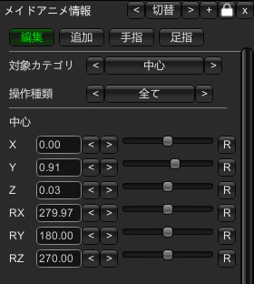

# COM3D2.MotionTimelineEditor.Plugin

v2.1.1.0


## 概要

モーションやカメラをタイムラインで編集するプラグインです。

MMDに近い操作でモーションを作成することを目的にしています。


## インストール方法

`Sybaris\UnityInjector`ディレクトリに下記ファイルを配置してください。

- `COM3D2.MotionTimelineEditor.Plugin.dll`
  - プラグインの本体。必須ファイル
- `COM3D2.MotionTimelineEditor_MeidoPhotoStudio.Plugin.dll`
  - 配置するとMeidoPhotoStudioで動作するようになります。任意で配置してください
- `COM3D2.MotionTimelineEditor_MultipleMaids.Plugin.dll`
  - 配置すると複数メイド撮影プラグインで動作するようになります。任意で配置してください
- `COM3D2.MotionTimelineEditor_DCM.Plugin.dll`
  - 配置すると表情/カメラなどが制御可能になります。任意で配置してください(DCMプラグインが必要)

COM3D2 Ver.2.33.1で動作確認済み。


## 推奨MOD

複数メイドかMeidoPhotoStudioのどちらかが入っていれば、エディット画面でも動作するようになります。

- 複数メイド撮影プラグインver23.1
https://ux.getuploader.com/cm3d2_j/download/181

- MeidoPhotoStudio
https://github.com/habeebweeb/MeidoPhotoStudio/releases


DCMが導入済みの場合、表情/カメラなどの制御が可能になります。

- COM3D2.DanceCameraMotion.Plugin7.5.1
https://ux.getuploader.com/com3d2_mod_kyouyu_g/download/98
https://ux.getuploader.com/com3d2_mod_kyouyu_g/download/79


下記プラグインを導入すると、スタジオモードでループ再生が可能になります。

- [1.2.0.0]スタジオモードモーション自動ループプラグイン
https://ux.getuploader.com/com3d2_mod_kyouyu/download/181


## 使い方の手順

1. **GUIの表示**: スタジオモード中か、エディット画面で`Ctrl+M`を押してGUIを表示します。歯車メニューの「MTE」アイコンからも表示できます。

2. **複数メイドの有効化**: エディット画面の場合は`F7`を押して、複数メイド撮影プラグインを有効化します。

3. **タイムラインの作成**: メイドを配置した後、ファイルメニューから新規作成ボタンをクリックして、タイムラインを作成します。0Fには現在のポーズがキーフレームとして自動的に追加されます。

4. **ポーズ編集モード**: ポーズ編集のチェックをいれて、ポーズ編集モードを有効化します。

5. **フレームの選択**: タイムラインの上部に表示されている任意のフレーム数をクリックして、編集したいフレームを選択します。

6. **ポーズの変更**: IKをドラッグしてポーズを変更します。
スタジオモード中は、タイムライン左側のボーン名をクリックすると、そのボーンの角度調整UIが表示されます。

7. **キーフレームの登録**: `Enter`キーを押して、変更したボーンのキーフレームを登録します。

8. **確認**: 再生ボタン(`Space`キー)を押して、モーションを確認します。その後は4-8を繰り返して、モーションを調整します。

9. **タイムラインの保存**: セーブボタンを押してタイムラインを保存します。保存したタイムラインは、ロードウィンドウからいつでもロード可能です。

10.  **アニメの出力**: アニメ出力ボタンを押して、作成したモーションをマイポーズに出力します。


詳細な操作方法については、Twitterに上げている動画などを参照してください。
https://twitter.com/kidonaru/status/1775174898111091134


## キーボード操作

| キー            | 機能                     |
|-----------------|--------------------------|
| **Ctrl+M**      | プラグイン表示切り替え   |
| **Tab**         | UI表示切り替え          |
| **Enter**       | キーフレームの登録 (ポーズ編集中のみ) |
| **Backspace**   | キーフレーム削除         |
| **Space**       | 再生/停止                |
| **F1**          | ポーズ編集モードの切り替え |
| **Ctrl+C**      | 選択したキーフレームのコピー |
| **Ctrl+V**      | コピーしたキーフレームのペースト |
| **Ctrl+Shift+V**| 反転ペースト             |
| **Ctrl+Alt+C**  | ポーズコピー             |
| **Ctrl+Alt+V**  | ポーズペースト (ポーズ編集中のみ) |
| **A**           | 前のフレームへ           |
| **D**           | 次のフレームへ           |
| **Ctrl+A**      | 前のポイントへ           |
| **Ctrl+D**      | 次のポイントへ           |
| **Shift**       | 複数選択                 |
| **Ctrl+Z**      | 操作履歴を一つ戻す       |
| **Ctrl+X**      | 操作履歴を一つ進める     |

一度起動すると下記パスに設定ファイルが作成されるので、
キーを変更したい場合はこちらを編集してください。
`Sybaris\UnityInjector\Config\MotionTimelineEditor.xml`

UnityのKeyCodeを使用できます。
https://docs.unity3d.com/ja/560/ScriptReference/KeyCode.html


## 機能

### メインウィンドウ


#### メインメニュー
- **ファイル**: ファイル出力まわりの操作
  - **新規作成**: タイムラインを新規に作成
  - **セーブ**: 現在のタイムラインを保存
  - **アニメ出力**: モーションをマイポーズに出力
  - **DCM出力**: DCM形式で出力
- **ロード**: タイムラインのロードウィンドウを表示
- **キーフレーム**: キーフレーム詳細ウィンドウを表示
- **情報**: 情報ウィンドウを表示
- **IK固定**: IK固定の設定ウィンドウを表示
- **トラック**: トラック設定ウィンドウを表示
- **メディア**: メディア再生ウィンドウを表示
- **履歴**: 操作履歴ウィンドウを表示
- **設定**: タイムラインの設定ウィンドウを表示

#### タイムライン操作
- **アニメ名**: モーションの名前を設定
- **最終フレーム番号**: 最終フレーム番号を設定
- **フレーム操作**: 現在のフレーム位置を操作
- **再生/停止**: モーションの再生と停止を切り替え
- **再生速度**: モーションの再生速度を調整

#### キーフレーム操作
- **登録**: 変更されたボーンをキーフレームに登録 (ポーズ編集中のみ)
- **全登録**: 全ボーンをキーフレームに登録
- **削除**: 選択中のキーフレームを削除
- **コピー**: 選択中のキーフレームをコピー
- **ペースト**: コピーしたキーフレームを現在のフレームに貼り付け
- **反転P**: 左右反転させて貼り付け
- **ポーズC**: 現在のポーズをキーフレームとしてコピー (ポーズ編集中のみ)
- **ポーズP**: コピーしたキーフレームを現在のポーズに反映 (ポーズ編集中のみ)

#### 選択操作
- **範囲選択**: 指定したフレーム範囲を選択
- **縦選択**: 選択しているフレーム内の全てのキーフレームを選択

#### レイヤー操作
- **レイヤー選択**: 操作対象のレイヤー種類を選択
- **操作対象**: 操作対象のメイドを選択

#### モード切り替え
- **簡易編集**: フレーム内のキーフレームを一括で編集できるモードに切り替え
- **ポーズ編集**: ポーズ編集モードに切り替え
- **メイド表示**: メイドの表示/非表示を切り替え
- **背景表示**: 背景の表示/非表示を切り替え
- **カメラ同期**: カメラモーションの同期/解除を切り替え
- **中心点IK表示**: 中心点IKの表示/非表示を切り替え (スタジオモード中のみ)
- **関節IK表示**: 各関節IKの表示/非表示を切り替え (スタジオモード中のみ)


### タイムライン操作

#### キーフレームの色
- **白**: 登録されているキーフレーム
- **赤**: 選択中のキーフレーム
- **グレー**: 一部のボーンが登録されているキーフレーム

#### 基本操作
- **フレーム番号**: クリックでそのフレームに移動
- **ボーン名**: 左のボーン名を選択で、そのボーンの角度調整UI表示 (ポーズ編集中のみ)
  - ボーンカテゴリのー＋をクリックで、そのカテゴリのボーン名の表示/非表示を切り替え
- **ドラッグ**: キーフレームをドラッグして移動
- **エリア選択**: キーフレーム以外の場所をドラッグで、短形内のキーフレームを選択
- **複数選択**: `Shift`キーを押しながらキーフレームをクリックで複数選択


### レイヤー操作

操作対象の種類のことをレイヤーと呼びます。
DCMが導入されている場合、レイヤーを切り替えることで、表情/カメラ/モデル/背景の操作が可能になります。

- **メイドアニメ**: メイドのモーション
- **メイド表情**: メイドの表情
- **メイド移動**: メイドの移動/回転
- **メイド瞳**: メイドの瞳位置/サイズ
- **カメラ**: カメラの動作
- **モデル**: モデルの移動/回転/拡縮
- **背景**: 背景の変更
- **背景色**: 背景色の変更

各レイヤーの編集は、ポーズ編集モードにして各パラメータを変更したあと、
`Enter`キーでキーフレームを登録すると反映されます。


### キーフレーム詳細ウィンドウ


- **X, Y, Z**: 選択したキーフレームの位置を調整
  - テキストボックスに数値を入力すると、選択したキーフレームの位置がその値になります
  - 複数の値が存在する場合は、空欄になります
  - `<<` `<` `>` `>>`ボタンで、0.01、0.1ずつ相対的に移動します
  - 移動は中心ボーンのみ変更できます
- **RX, RY, RZ**: 選択したキーフレームの角度を調整
  - `<<` `<` `>` `>>`ボタンで、1、10ずつ相対的に変更します
- **初期化**: 選択したキーフレームの位置と角度を初期化
- **補間曲線**: 選択したキーフレームの補間曲線を表示します
- **Tangent設定**: Tangentに対応したキーフレームの場合、Tangentの設定が可能です
  - **表示種類**: 右の選択ボタンで、表示する補間曲線の種類を切り替えます
  - **OutTangent**: 前のフレームのOutTangentを調整
  - **InTangent**: 選択中のフレームのInTangentを調整
  - **自動補間**: 自動補間を有効にする
  - **プリセット反映**: プリセットを反映します
    - EaseInOut、EaseIn、EaseOut、Linearが選択可能
- **Easing設定**: Easingに対応したキーフレームの場合、Easingの設定が可能です
  - **Easing**: Easingの種類を選択


### 情報ウィンドウ



選択中のレイヤーに応じて各種現在値を表示します。
ポーズ編集中では、値の編集も可能です。

- **X, Y, Z**: 対象の座標を変更
- **RX, RY, RZ**: 対象の角度を変更
- **SX, SY, SZ**: 対象のスケールを変更

#### メイドアニメ情報ウィンドウ


- **指操作**: 指のブレンドを変更 (スタジオモードと同等機能になります)

#### メイド表情情報ウィンドウ


表情を調整することができます。

#### メイド瞳情報ウィンドウ


画像上をドラッグすることで、瞳の位置を変更することができます。
数値入力で各位置とサイズを変更することも可能です。

#### カメラ情報ウィンドウ


- **距離**: カメラの距離を変更
- **FoV**: カメラの視野角を変更
- **対象設定**: カメラを対象の位置まで移動させます
  - **対象メイド**: 対象のメイドを選択
  - **対象ポイント**: 移動先の部位を選択
  - **対象モデル**: 対象のモデルを選択

#### 背景色情報ウィンドウ


背景色を変更することができます。


### IK固定ウィンドウ


各IKをワールド座標に固定化することができます。
ポーズ編集中のみ有効です。


### トラック設定ウィンドウ


特定の範囲内に限定して編集、再生することができます。

長いタイムラインでは動作が重くなるので、トラックを使って編集することをおすすめします。

範囲の開始、終了位置にキーフレームを全登録することで、より動作の軽量化ができます。

- **追加**: 新しいトラックを追加
- **チェックボックス**: トラックの有効/無効を切り替え
  - トラックが有効の場合、その範囲内のみ編集、再生が可能になります
- **トラック名**: トラックの名前を設定
- **範囲**: トラックの範囲を設定
- **削除**: トラックを削除
- **∧/∨**: トラックを上下に移動


### メディア再生ウィンドウ


BGMと動画の設定ができます。

DCM出力時に0.5秒の開始遅延があるので、0.5秒後から再生されます。
(開始遅延秒数は設定から変更可能)

DCM出力時にBGMは再生できますが、動画は対応していません。

- **BGM設定**: BGM再生機能の設定
  - **BGMパス**: 再生するBGMファイルのパス
    - 動画のフォーマットはoggかwavを指定できます
  - **選択**: BGMを選択
  - **再読込**: BGMを再読み込み

- **有効**: 動画再生機能を有効にします
- **表示形式**: GUI、3Dビュー、最背面表示を切り替えます
- **動画パス**: 再生する動画ファイルのパス
- **選択**: 動画を選択します
  - 動画のフォーマットは非圧縮aviを推奨します
- **再読込**: 動画を再読み込みします
- **開始位置**: 動画の開始位置を設定
- **X, Y, Z**: 動画の位置を調整
- **RX, RY, RZ**: 動画の角度を調整
- **表示サイズ**: 動画の表示サイズを設定
- **透過度**: 動画の透過度を設定
- **音量**: 動画の音量を設定


### 操作履歴ウィンドウ


タイムラインの操作履歴が表示されます。

履歴を選択すると、その状態に戻ることができます。

- **最大履歴数**: 保持する最大の履歴数を設定
  - 履歴数分メモリを消費するので、必要な数だけに設定してください
- **クリア**: 履歴をクリア

`Ctrl+Z`で一つ前の履歴に、`Ctrl+X`で一つ後の履歴に戻すことができます。


### 設定ウィンドウ

#### 個別設定


各タイムライン個別の設定を行います

- **格納ディレクトリ名**: タイムラインの保存先のサブディレクトリ名を設定
- **フレームレート**: タイムラインのフレームレートを設定
- **メイド目線**: メイドの目線を設定します
- **顔/瞳の固定化**: カメラ追従を無効にして、タイムラインで制御可能な状態にします
- **胸の物理無効**: 胸の物理演算を無効にする
- **ループアニメーション**: ループ再生用のアニメーションにします
  - 出力時、0Fのキーフレームをコピーして、最終フレームに貼り付けます
- **オフセット時間**: DCM出力時の開始/終了時間のオフセットを設定
- **フェード時間**: DCM出力時のフェードイン/アウト時間を設定
- **初期化**: タイムライン個別設定を初期化
- **サムネ更新**: サムネイルを再生成します

#### 共通設定


全タイムライン共通の設定を行います

- **初期補間曲線**: 新規で追加するキーフレームの補間曲線を設定
- **Trans詳細表示数**: キーフレーム詳細ウィンドウで表示するTransformの最大数
  - キーフレーム詳細が重い場合は下げると改善することがあります
- **Tangent表示数**: キーフレーム詳細ウィンドウで表示する補間曲線の最大数
- **自動スクロール**: タイムラインの自動スクロールを有効にする
- **背景透過度**: タイムラインの背景の透過度を設定
- **初期化**: タイムライン共通設定を初期化


## タイムラインの保存形式

`COM3D2\PhotoModeData\_Timeline`ディレクトリに`アニメ名.xml`と、サムネ画像が`アニメ名.png`で保存されます。
タイムラインを共有したい場合は、このファイルを共有してください。

中身のサンプル:

```xml
<TimelineData>
  <Frame>
    <FrameNo>0</FrameNo>
    <Bone>
      <Transform>
        <Name>Bip01</Name>
        <Value>0</Value>
        ...
      </Transform>
    </Bone>
    ...
  </Frame>
  <AnmName>アニメ名</AnmName>
  <IsHold>false</IsHold>
  ...
  <IsLoopAnm>true</IsLoopAnm>
  <MaxFrameNo>30</MaxFrameNo>
  <FrameRate>30</FrameRate>
  <UseMuneKeyL>false</UseMuneKeyL>
  <UseMuneKeyR>false</UseMuneKeyR>
```

## アニメ出力先

アニメ出力ボタンから出力されるanmファイルの出力先は、使用しているプラグインによって変わります。

- **複数メイド**: Mod\MultipleMaidsPose
- **MPS**: BepInEx\config\MeidoPhotoStudio\Presets\Custom Poses
- **スタジオモード**: PhotoModeData\MyPose


## DCM出力形式

DCM出力をすると、`UnityInjector\Config\DanceCameraMotion`にDCMで再生可能な形式で出力されます。

DCMで再生するときは処理が干渉することがあるので、MTEを閉じてから再生してください。

出力のサンプル:

```xml
<SongList>
  <song label="【MTE】アニメ名" type="song">
    <folder>【MTE】アニメ名</folder>
    <endTime>15.2666674</endTime>
    <bgm>bgm.ogg</bgm>
    <changeFade>fade.csv</changeFade>
    <maid slotNo="0">
      <pose>pose_0.csv</pose>
      <morph>morph_0.csv</morph>
      <move>move_0.csv</move>
    </maid>
    <maid slotNo="1">
      <move>move_1.csv</move>
      <morph>morph_1.csv</morph>
      <pose>pose_1.csv</pose>
    </maid>
    <changeModel>model.csv</changeModel>
    <changeBg>bg.csv</changeBg>
    <!--<customMotion>camera_timeline.csv</customMotion>-->
    <motion>camera_motion.csv</motion>
  </song>
</SongList>
```

カメラは`customMotion`と`motion`の2つの形式で出力されます。
基本的にどちらも同じ挙動になりますが、`customMotion`ではフレームレート30固定になるのでフレームレートによっては挙動が変わることがあります。


## 変更履歴

### 2024/05/19 v2.1.0.0

機能追加
- 瞳/背景色レイヤーの追加
- 表情情報ウィンドウから直接表情を変更可能に
- 足指のブレンド調整追加
- 顔/瞳の固定化オプション追加
  - 有効にするとカメラ追従を無効にして、タイムラインで制御可能な状態にします

挙動修正
- IK固定時に手足が伸びるバグを修正
- 頭/胸/骨盤の反転対応
- 角度リセットの初期値修正
- マイオブジェクトの配置対応
  - DCM出力には対応していません
- コンボボックスにカーソル追加
- 背景非表示をタイムライン毎に保存するように修正
  - DCM出力時にも反映されます
- 設定ウィンドウの個別/共通設定をタブ分け


### 2024/05/14 v2.0.0.0

機能追加
- 複数キャラのアニメ制御
- 表情/カメラ/モデル/背景のタイムライン制御
  - 内部でDCMを使用しているため、DCMの導入が必要です
- DCMへの出力機能
  - フレームレート30以外だと表示が崩れることがあります
- BGM再生機能
- 動画表示種類に最背面を追加
- 情報ウィンドウ追加
  - ポーズ編集中の現在値を直接編集できます
- 指のブレンド機能
  - スタジオモードと同等の機能が複数メイドでも使用可能になります
- UI非表示のキー追加
- メイド/背景の一時的な非表示機能

挙動修正
- フレーム移動のキーリピート対応
- メニューの開閉状態の保存
- 非ループアニメも再生時にループするように
- アイコン更新 (MTEの文字列になりました)

### 2024/04/21 v1.3.0.1

- スタジオモードでF0のキーフレームを編集すると再生されてしまう不具合の修正
- 「ポーズC(ポーズコピー)」ボタンの追加
  - 現在のポーズをキーフレームとしてコピーします

### 2024/04/21 v1.3.0.0

機能追加
- MeidoPhotoStudio対応
  - MeidoPhotoStudioでも動作するようになりました
  - また、複数メイド/MeidoPhotoStudio機能は別DLLにしたので、インストールしていない場合はスタジオモードのみで動作します
- Undo/Redoの実装
  - `Ctrl+Z`でUndo、`Ctrl+X`でRedoができます
- トラックの実装
  - 特定範囲内のみの編集、再生ができます
  - 長いタイムラインでは動作が重くなるので、トラックを使って編集することをおすすめします
- タイムラインのサブディレクトリ対応
  - 設定ウィンドウでタイムライン保存先のサブディレクトリ名を指定できます
- ポーズペースト機能
  - キーフレームをコピーした後、ポーズ編集中に「ポーズP」で編集中のポーズに反映させることができます
  - キーフレームには「登録」するまで反映されません

挙動修正
- フレームの移動をしたときに、スクロール位置を表示領域内に調整するように
- サムネ生成済みの場合、セーブしたときに上書きしないように
  - 設定ウィンドウの「サムネ更新」で再生成できます
- キーフレームの追加を「登録」にリネーム

バグ修正
- 1489フレーム以上でエラーが発生する
- 固定化時に特定条件で手足が伸びる
- メイドの回転がアニメに反映されない

### 2024/04/15 v1.2.0.2
- 非ループアニメーションのバグ修正
  - 最終フレームで正しく補間されない
  - アニメ終了後シークできない

### 2024/04/14 v1.2.0.1
- 自動補間で前フレームとの差分が0の場合に補間されていなかったのを修正
- スタジオモードで2回目のロード時にエラーが発生していたのを修正
- キー設定の読み込みに失敗していたのを修正

### 2024/04/14 v1.2.0.0
- 複数メイド撮影プラグイン対応
  - 朝／夜メニューとエディット画面でも使用可能になりました
  - ※複数メイド撮影プラグインが必須となります
- 動画再生機能の追加
  - タイムラインに合わせて動画を再生できるようになりました
  - 動画のフォーマットは非圧縮aviを推奨します
- IK固定化機能の改善
  - 回転等の操作でも固定化が適用されるようになりました
- キーボード操作の追加
  - キーフレームのコピー、ペースト、反転ペーストなどが追加されました
  - キー設定がリセットされるので、変更していた場合は再設定が必要です
- 胸の物理無効化が反映されないバグの修正

### 2024/04/07 v1.1.0.0
- キーフレームの一括値変更機能を追加
  - メインメニューの「キーフレーム」から使用できます
- 補間曲線の設定機能を追加
  - デフォルトが自動補間ありになっているため、前のバージョンと動きが変わります
  - 以前の挙動と合わせたい場合は、全フレームを選択してキーフレーム詳細を開き、プリセットで一番左のEaseInOutを選択してください

### 2024/04/03 v1.0.0.1
- しばりす2環境で動作するように修正

### 2024/04/02 v1.0.0.0
- 公開版リリース


## 規約


### 作成したデータについて

このプラグインで作成したタイムライン、モーションデータは自由に配布して問題ありません。

ただし、公式モーションをそのままコピーして配布したり、別ゲームでの利用などは禁止です。


### MOD規約

※MODはKISSサポート対象外です。
※MODを利用するに当たり、問題が発生してもKISSは一切の責任を負いかねます。
※「カスタムメイド3D2」か「カスタムオーダーメイド3D2」か「CR EditSystem」を購入されている方のみが利用できます。
※「カスタムメイド3D2」か「カスタムオーダーメイド3D2」か「CR EditSystem」上で表示する目的以外の利用は禁止します。
※これらの事項は http://kisskiss.tv/kiss/diary.php?no=558 を優先します。


個人の利用範囲でのプラグインの改造は自由ですが、.anmや.vmdを直接読み込む機能の追加は禁止です。

他の機能追加などをしたい場合は、リポジトリを公開しているのでこちらにPRをお願いします。
https://github.com/kidonaru/COM3D2.MotionTimelineEditor.Plugin

質問、要望などは@kidonaruまで (可能な範囲で対応します)
https://twitter.com/kidonaru


### プラグイン開発者向け

このプラグインの開発に手伝っていただける場合、下記手順でプルリクエストを送信してください。

1. このリポジトリをフォークします

2. フォークしたリポジトリを、ローカルの`COM3D2\Sybaris`以下にクローン
```bash
cd [COM3D2のインストールディレクトリ]\Sybaris
git clone https://github.com/[自分のユーザー名]/COM3D2.MotionTimelineEditor.Plugin.git
```

3. クローンしたディレクトリをVS Codeなどで開く

4. コード修正後、デバッグ用ビルドスクリプトを実行し動作確認
(自動でUnityInjector内にコピーされます)
```bash
.\debug.bat
```

5. 差分をリモートにプッシュして、フォーク元に対してプルリクエストを送信
